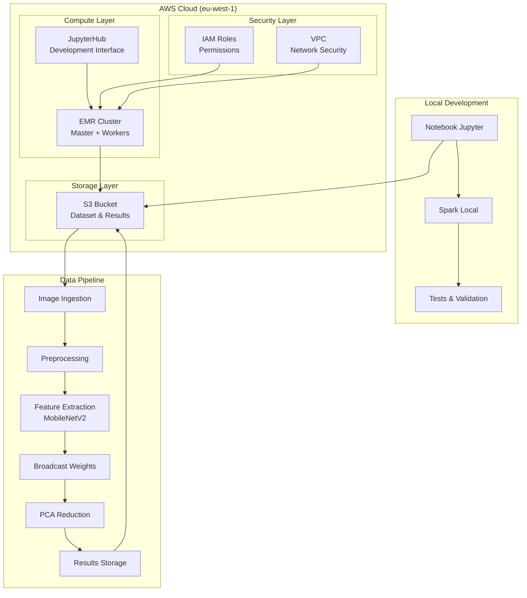

# Architecture Big Data - Projet P9 Fruits! Classification

## Vue d'ensemble

**Projet :** Architecture Big Data pour la classification d'images de fruits
**Contexte :** Start-up AgriTech "Fruits!" - Application mobile de reconnaissance
**Objectif :** Pipeline PySpark scalable avec EMR AWS et conformité RGPD

## Architecture Globale

### Vue d'ensemble de l'Architecture



## Composants de l'Architecture

### Couche Cloud AWS

#### Amazon S3 (Stockage)

**Rôle :** Stockage centralisé des données et résultats
**Configuration :**

- **Région :** eu-west-1 (conformité RGPD)
- **Buckets :**
  - `fruits-dataset-bucket` : Dataset Fruits-360
  - `fruits-results-bucket` : Résultats PCA et métriques
- **Permissions :** IAM roles pour accès sécurisé
- **Formats :** JPG (images), CSV (matrices PCA), Parquet (optimisation)

#### Amazon EMR (Calcul Distribué)

**Rôle :** Cluster de calcul pour traitement PySpark
**Configuration :**

- **Type :** Cluster temporaire (optimisation coûts)
- **Master :** 1 instance m5.xlarge
- **Workers :** 2-4 instances m5.large (auto-scaling)
- **Logiciels :** Spark 3.4, JupyterHub, TensorFlow
- **Réseau :** VPC privé avec accès SSH

#### AWS IAM (Sécurité)

**Rôle :** Gestion des permissions et accès
**Configuration :**

- **EMR Service Role :** Accès aux services AWS
- **EC2 Instance Profile :** Permissions pour les instances
- **S3 Access Policies :** Lecture/écriture sur buckets
- **Principle of Least Privilege :** Permissions minimales

### Pipeline de Traitement

#### 1. Ingestion des Données

```python
# Chargement depuis S3
df = spark.read.format("binaryFile") \
    .option("pathGlobFilter", "*.jpg") \
    .option("recursiveFileLookup", "true") \
    .load("s3://fruits-dataset-bucket/")
```

#### 2. Preprocessing

- **Normalisation :** Redimensionnement et standardisation
- **Partitioning :** Distribution optimale sur les workers
- **Caching :** Mise en cache des DataFrames fréquemment utilisés

#### 3. Feature Extraction

```python
# MobileNetV2 pour extraction de features
model = tf.keras.applications.MobileNetV2(
    input_shape=(224, 224, 3),
    include_top=False,
    weights='imagenet'
)
```

#### 4. Broadcast des Poids

```python
# Diffusion du modèle sur tous les workers
broadcast_model = spark.sparkContext.broadcast(model)
```

#### 5. Réduction de Dimension (PCA)

```python
# PCA en PySpark
from pyspark.ml.feature import PCA
pca = PCA(k=100, inputCol="features", outputCol="pca_features")
```

#### 6. Sauvegarde des Résultats

```python
# Écriture sur S3
results.write.mode("overwrite") \
    .option("header", "true") \
    .csv("s3://fruits-results-bucket/pca_results/")
```

## Architecture de Sécurité

### Conformité RGPD

**Localisation des Données :**

- **Stockage :** S3 eu-west-1 (Irlande)
- **Traitement :** EMR eu-west-1 (Irlande)
- **Logs :** CloudWatch eu-west-1
- **Documentation :** Traçabilité complète

**Mesures de Protection :**

- **Chiffrement :** AES-256 en transit et au repos
- **Accès :** IAM avec MFA recommandé
- **Audit :** CloudTrail pour traçabilité
- **Rétention :** Politique de suppression automatique

### Sécurité Réseau

**VPC Configuration :**

- **Subnets :** Privées pour le cluster EMR
- **Security Groups :** Accès SSH restreint
- **NAT Gateway :** Accès internet pour téléchargements
- **VPN :** Tunnel SSH pour accès JupyterHub

## Optimisations de Performance

### Optimisations Spark

**Configuration Cluster :**

```yaml
spark:
  executor:
    instances: 4
    cores: 2
    memory: "4g"
  driver:
    memory: "2g"
  sql:
    adaptive:
      enabled: true
      coalescePartitions:
        enabled: true
```

**Optimisations de Code :**

- **Partitioning :** Distribution équitable des données
- **Broadcast Variables :** Modèles TensorFlow diffusés
- **Caching :** DataFrames mis en cache
- **Serialization :** Kryo pour performance

### Optimisation des Coûts (CRITIQUE)

**Stratégies prioritaires :**

- **Instances Spot :** Réduction jusqu'à 90% des coûts (PRIORITÉ ABSOLUE)
- **Instances Graviton2 :** Réduction de 35% des coûts + 15% de performance
- **Auto-scaling intelligent :** Ajustement dynamique selon la charge réelle
- **Résiliation immédiate :** Arrêt automatique après traitement
- **S3 comme stockage principal :** Séparation stockage/calcul pour flexibilité
- **Formats optimisés :** Parquet/ORC pour réduire les coûts de traitement
- **Monitoring strict :** Alertes budget et surveillance continue

**Estimation des coûts :**

- **Développement (5 jours × 1.5h/jour) :** ~1.20€
- **Démonstration (1.5h) :** ~0.24€
- **Stockage S3 (1 mois) :** ~0.25€
- **TOTAL ESTIMÉ : 1.69€** (83% d'économie par rapport au budget de 10€)

## Monitoring et Observabilité

### Métriques de Performance

**Spark Metrics :**

- **Throughput :** Images traitées par seconde
- **Latence :** Temps de traitement par batch
- **Utilisation :** CPU, mémoire, réseau
- **Erreurs :** Taux d'échec des tâches

**AWS Metrics :**

- **EMR :** Utilisation des instances
- **S3 :** Requêtes et transferts
- **CloudWatch :** Logs et métriques système

### Debugging et Troubleshooting

**Outils :**

- **Spark UI :** Interface de monitoring en temps réel
- **History Server :** Historique des applications
- **CloudWatch Logs :** Centralisation des logs
- **JupyterHub :** Debugging interactif

## Déploiement et CI/CD

### Pipeline de Déploiement

**Étapes :**

1. **Développement local** avec Poetry
2. **Tests unitaires** avec pytest
3. **Validation** sur Spark local
4. **Déploiement** sur EMR temporaire
5. **Exécution** et validation des résultats
6. **Résiliation** pour optimiser les coûts

### Livrables

**Code :**

- Notebook PySpark exécutable
- Scripts de déploiement automatisé
- Documentation technique complète

**Infrastructure :**

- Terraform/CloudFormation pour EMR
- Scripts de configuration automatique
- Monitoring et alertes

**Données :**

- Dataset traité sur S3
- Matrices PCA en CSV
- Métriques de performance

## Évolutivité et Maintenance

### Scalabilité

**Horizontal Scaling :**

- **Workers :** Ajout dynamique d'instances
- **Partitioning :** Distribution automatique
- **Load Balancing :** Répartition de la charge

**Vertical Scaling :**

- **Instances :** Upgrade des types d'instances
- **Mémoire :** Augmentation de la RAM
- **CPU :** Plus de cores pour traitement

### Maintenance

**Opérations :**

- **Monitoring :** Surveillance continue
- **Backup :** Sauvegarde des configurations
- **Updates :** Mise à jour des versions
- **Security :** Patchs de sécurité

**Documentation :**

- **Runbooks :** Procédures opérationnelles
- **Architecture :** Documentation technique
- **Troubleshooting :** Guide de résolution

---

**Dernière mise à jour :** [Date]
**Responsable :** Data Scientist
**Statut :** En cours de développement
